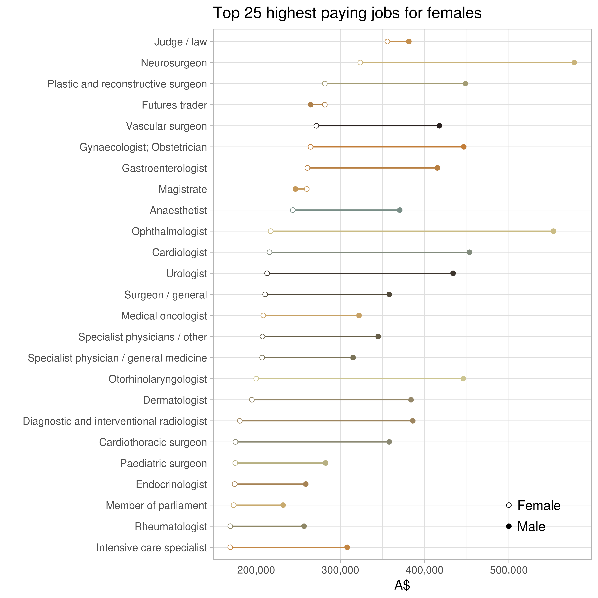
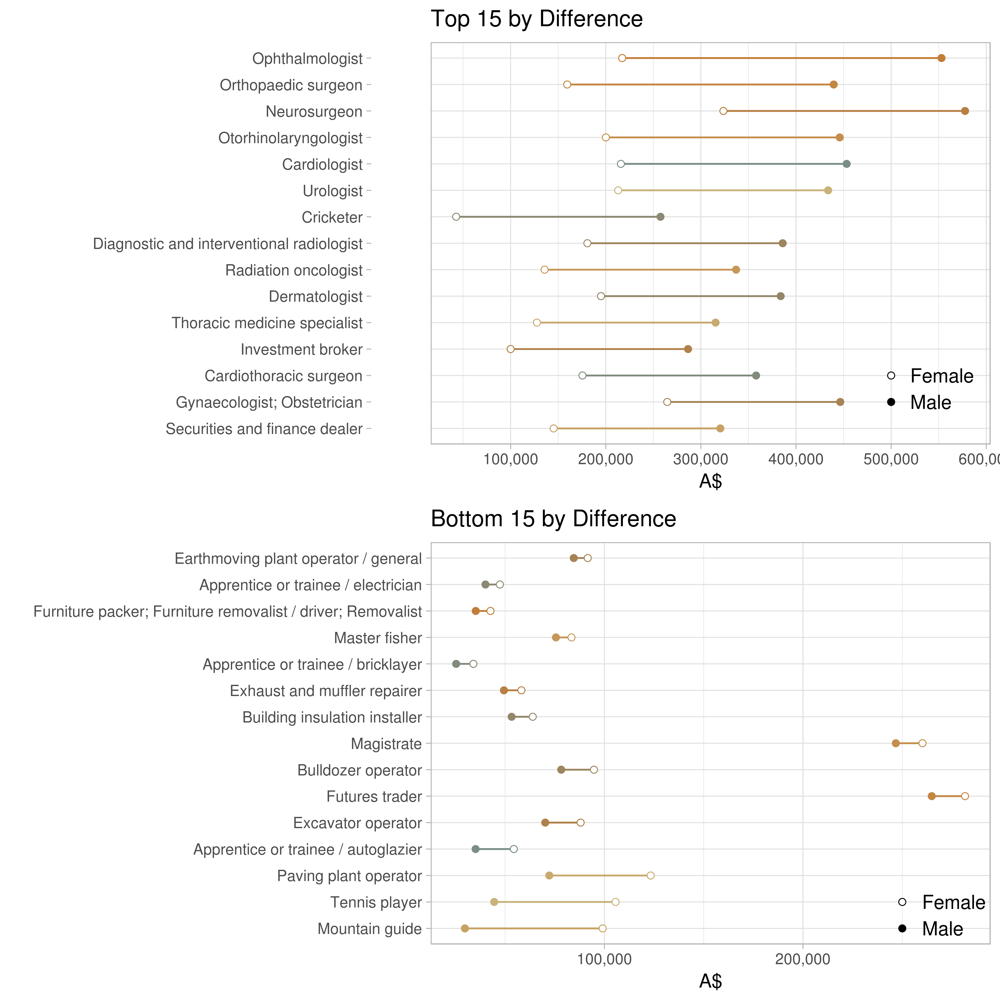
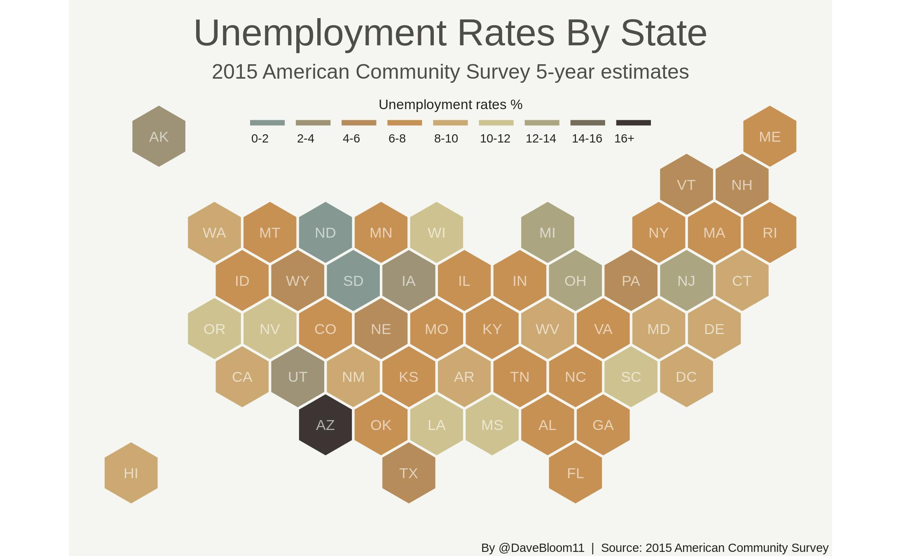
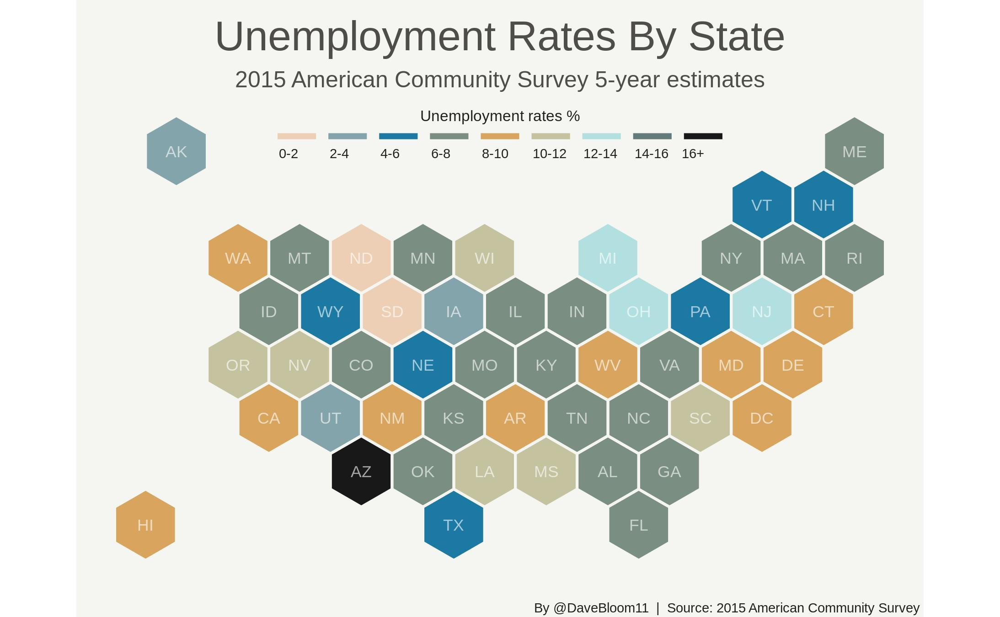
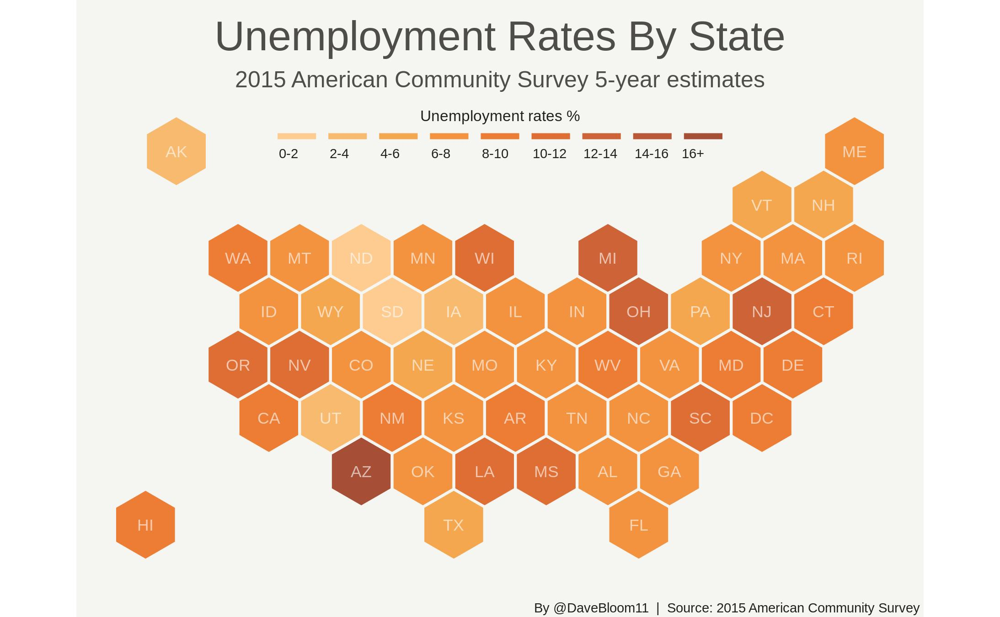
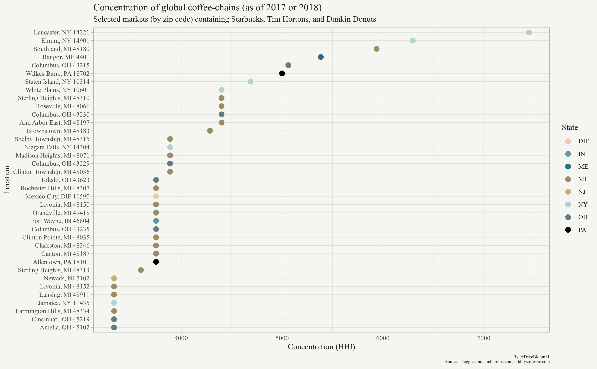
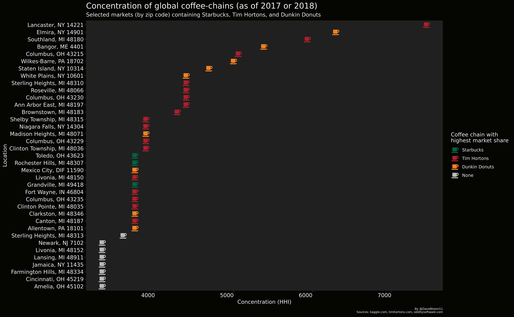

# TidyTuesday
See https://github.com/rfordatascience/tidytuesday for more information.

### Week 4: Gender differences in taxable income in Australia

### Week 5: County-level American Community Survey (5-year estimates) 2015

### Week 6: Global coffee-chain locations

