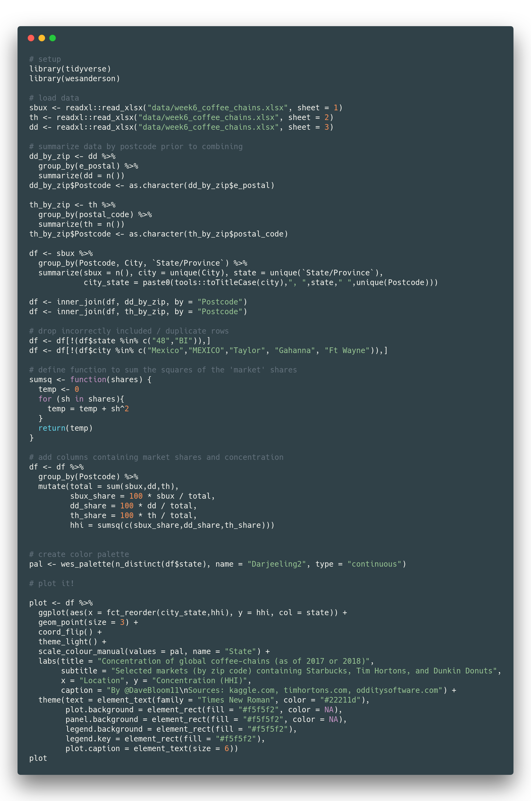

# tidytuesday_wk6
### Global coffee-chain locations (as of 2017 or 2018)

This week we were provided with location data for Starbucks, Tim Hortons, and Dunkin Donuts coffee chains. I thought it would be interesting to look at market concentration in markets where these chains all competed. I defined markets by zip code with the assumption that most people wouldn't travel outside their zip code for a cup of coffee; this could be refined, but it was a simplifying assumption. I used the Herfindahl-Hirschman Index (HHI) to measure concentration since I happened to be familiar with it. I also calculated market share by number of locations since I didn't have sales data. I further assumed there was no other competition in these markets, which explains the very high concentrations. 

See https://github.com/rfordatascience/tidytuesday for more information on #TidyTuesday.

